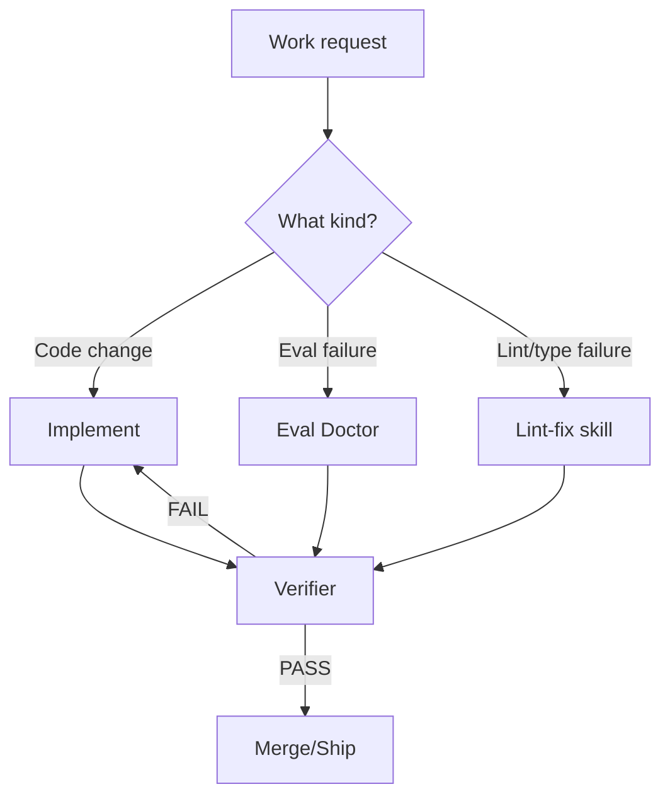

# Cursor & Claude Code development kit

This repo is a set of **defaults** for building LLM agents that don't behave like reckless interns with `rm -rf` access.

If you want "agents that seem smart in demos but regress in prod," you don't need this repo. Just keep adding few-shot examples until morale improves.

---

## How work flows here



---

## What this repo enforces

### 1) Minimal diffs

No ornamental refactors. No drive-by cleanups.
Agents love rewriting your code "for clarity." That's how you get bugs that look like style changes.

### 2) Verification is mandatory

If lint/type/tests weren't run, the change is not done.
Not "should pass." Not "looks correct." Run the checks.

### 3) Safety is not a vibe

"Please don't drop prod" is not a control system.If safety is non-negotiable, enforce it with:

- Cursor hooks
- Claude Code permissions (deny / ask / allow)

### 4) Evals drive agent improvement

When an eval fails, we do **root cause analysis** and fix the class of failures.
We do not "fix" by stuffing the failing case into a prompt and calling it generalization.

---

## Supported tooling

- **Cursor**: Rules + subagents (+ hooks for enforcement)Docs: [Rules](https://cursor.com/docs/context/rules), [Subagents](https://cursor.com/docs/context/subagents), [Skills](https://cursor.com/docs/context/skills), [Hooks](https://cursor.com/docs/agent/hooks)
- **Claude Code**: `CLAUDE.md` + permissions + subagents + skillsDocs: [Overview](https://code.claude.com/docs/en/overview), [Sub-agents](https://code.claude.com/docs/en/sub-agents), [Permissions](https://code.claude.com/docs/en/permissions), [Skills](https://code.claude.com/docs/en/skills)
- **Agent evaluation guidance** (for the Eval Doctor flow):
  [DeepEval agent evaluation](https://deepeval.com/guides/guides-ai-agent-evaluation)

---

## Repo layout

### Cursor

```
cursor/          → symlink or copy to .cursor/
  AGENTS.md
  rules/
    00-safety.mdc
    10-quality.mdc
    11-quality-ts.mdc
    20-evals.mdc
  agents/
    verifier.md
    eval-doctor.md
  skills/
    lint_mypy_fix.md
  hooks.json
  hooks/
    block-destructive.sh
```

### Claude Code

```
claude/          → symlink or copy to .claude/
  CLAUDE.md      → also needs a symlink at repo root (or ~/.claude/)
  settings.json
  agents/
    verifier.md
    eval-doctor.md
  skills/
    lint-fix/
      SKILL.md
```

---

## Core components

### Verifier (subagent)

**Role:** final gate before "done."

It enforces:

- Minimal diffs (rejects drive-by refactors)
- Safety hazards (destructive ops require explicit plan + confirmation)
- Verification evidence (what commands were run)

Output is structured (PASS/FAIL + checks run) so it can be enforced by hooks/CI later.

Docs: [Cursor Subagents](https://cursor.com/docs/context/subagents), [Claude Sub-agents](https://code.claude.com/docs/en/sub-agents)

---

### Eval Doctor (subagent)

**Role:** fix eval failures without overfitting.

Rules:

- No trace/logs → no diagnosis (collect traces first)
- Diagnose by failure layer (tool use vs completion)
- Prefer general fixes in this order:
  1) Tool contract/schema
  2) Decision logic/routing/stopping
  3) Retrieval/context selection
  4) Prompt contract clarity
  5) Architecture (last resort)
- Validate on:
  - Dev set (iterate fast)
  - Held-out set (prove generalization)
  - Multi-trial if stochastic

Docs: [Claude Sub-agents](https://code.claude.com/docs/en/sub-agents), [DeepEval agent evaluation](https://deepeval.com/guides/guides-ai-agent-evaluation)

---

### Lint/Type Fix Loop (skill)

**Role:** do the boring work without wasting the main agent.

It:

- Iterates ruff/mypy fixes up to N times
- Uses minimal diffs
- Refuses to "silence" mypy via `Any` or blanket ignores unless justified

Docs: [Cursor Skills](https://cursor.com/docs/context/skills), [Claude Skills](https://code.claude.com/docs/en/skills)

---

## Safety model

**Policy** lives in:

- Cursor rules
- `CLAUDE.md`

**Enforcement** lives in:

- Cursor hooks (recommended for destructive command blocking)
- Claude Code permissions (`deny` / `ask` / `allow`)

If you only write safety policies in markdown, you haven't implemented safety. You've implemented optimism.

Docs: [Cursor Hooks](https://cursor.com/docs/agent/hooks), [Claude Permissions](https://code.claude.com/docs/en/permissions)

---

## How to adopt this in a project

### Option A: Copy into your repo

#### Cursor

1) Copy `cursor/` contents into `.cursor/` in your repo.
2) Adjust `globs` and any repo-specific commands referenced by your team.
3) Add hooks for destructive-command blocking if needed.
4) Make "Verifier PASS" a requirement before merge.

#### Claude Code

1) Copy `claude/CLAUDE.md` to `CLAUDE.md` and `claude/` contents into `.claude/` in your repo.
2) Tailor `.claude/settings.json` permission patterns to match your infra/tooling.
3) Make "Verifier PASS" the standard before shipping.

### Option B: Symlink from this repo (shared across projects)

Instead of copying, symlink so every project points to a single source of truth. Updates to this repo propagate everywhere automatically.

Set `KIT` to wherever you cloned this repo:

```bash
KIT="$HOME/Development/cursor-claude-kit"
```

#### Cursor — per-project symlinks

From the root of any project:

```bash
mkdir -p .cursor
cp "$KIT/cursor/AGENTS.md"  .cursor/AGENTS.md
ln -s "$KIT/cursor/rules"      .cursor/rules
ln -s "$KIT/cursor/agents"     .cursor/agents
ln -s "$KIT/cursor/skills"     .cursor/skills
ln -s "$KIT/cursor/hooks.json" .cursor/hooks.json
ln -s "$KIT/cursor/hooks"      .cursor/hooks
```

Or symlink the entire directory at once:

```bash
ln -s "$KIT/cursor" .cursor
```

#### Claude Code — per-project symlinks

From the root of any project:

```bash
mkdir -p .claude
cp "$KIT/claude/CLAUDE.md"     CLAUDE.md
ln -s "$KIT/claude/settings.json" .claude/settings.json
ln -s "$KIT/claude/agents"        .claude/agents
ln -s "$KIT/claude/skills"        .claude/skills
```

Or symlink the entire directory:

```bash
ln -s "$KIT/claude" .claude
ln -s "$KIT/claude/CLAUDE.md" CLAUDE.md
```

#### Claude Code — global (applies to all projects)

Claude Code supports a global `~/.claude/` directory. Symlink there to apply defaults everywhere without touching individual repos:

```bash
ln -s "$KIT/claude/CLAUDE.md"     ~/.claude/CLAUDE.md
ln -s "$KIT/claude/settings.json" ~/.claude/settings.json
ln -s "$KIT/claude/agents"        ~/.claude/agents
ln -s "$KIT/claude/skills"        ~/.claude/skills
```

> **Tip:** Per-project files take precedence over global ones in Claude Code, so you can still override per-repo when needed.

> **Git note:** Symlinks show up as untracked files. Add them to `.gitignore` if you don't want to commit them, or commit the symlinks (git preserves symlink targets).

---

## Contribution rules

- New rules: must be scoped and high leverage. No generic "write clean code" essays.
- New subagents: must have a single responsibility and clear triggers.
- New skills: should be deterministic, repeatable procedures.
- Anything safety-related should include an enforcement story (hooks/permissions), not just prose.

Keep it small. Keep it enforceable. Keep it boring in production.
