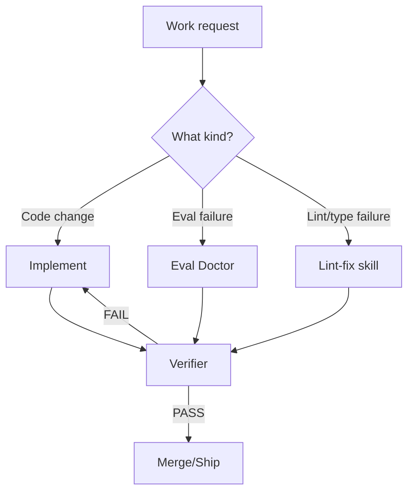

# Cursor, Claude Code & Codex development kit

This repo is a set of **defaults** for building LLM agents that don't behave like reckless interns with `rm -rf` access.

If you want "agents that seem smart in demos but regress in prod," you don't need this repo. Just keep adding few-shot examples until morale improves.

---

## How work flows here


```mermaid
flowchart TD
  A["Work request"] --> B{"What kind?"}

  B -->|"Code change"| C["Implement"]
  B -->|"Eval failure"| D["Eval Doctor"]
  B -->|"Lint/type failure"| E["Lint-fix skill"]

  C --> F["Verifier"]
  D --> F
  E --> F

  F -->|"PASS"| G["Merge/Ship"]
  F -->|"FAIL"| C
```

---

## What this repo enforces

### 1) Minimal diffs

No ornamental refactors. No drive-by cleanups.
Agents love rewriting your code "for clarity." That's how you get bugs that look like style changes.

### 2) Verification is mandatory

If lint/type/tests weren't run, the change is not done.
Not "should pass." Not "looks correct." Run the checks.

### 3) Safety is not a vibe

"Please don't drop prod" is not a control system.If safety is non-negotiable, enforce it with:

- Cursor hooks
- Claude Code permissions (deny / ask / allow)
- Codex approval modes (suggest / auto-edit)

### 4) Evals drive agent improvement

When an eval fails, we do **root cause analysis** and fix the class of failures.
We do not "fix" by stuffing the failing case into a prompt and calling it generalization.

---

## Supported tooling

- **Cursor**: Rules + subagents (+ hooks for enforcement)
  Docs: [Rules](https://cursor.com/docs/context/rules), [Subagents](https://cursor.com/docs/context/subagents), [Skills](https://cursor.com/docs/context/skills), [Hooks](https://cursor.com/docs/agent/hooks)
- **Claude Code**: `CLAUDE.md` + permissions + subagents + skills
  Docs: [Overview](https://code.claude.com/docs/en/overview), [Sub-agents](https://code.claude.com/docs/en/sub-agents), [Permissions](https://code.claude.com/docs/en/permissions), [Skills](https://code.claude.com/docs/en/skills)
- **OpenAI Codex**: `AGENTS.md` at repo root
  Install: `npm i -g @openai/codex` · Run: `codex`
- **Gemini / Google AI in the IDE**: there is no single universal project filename across products. Point your workspace or custom instructions at repo-root **`AGENTS.md`**, or add a thin **`GEMINI.md`** (or equivalent) that tells the agent to read `AGENTS.md` first and only adds Gemini-specific notes.
- **Agent evaluation guidance** (for the Eval Doctor flow):
  [DeepEval agent evaluation](https://deepeval.com/guides/guides-ai-agent-evaluation)

## Extra docs

- [Worktrees + MCP setup (Cursor, Claude Code, Codex)](doc/worktree-mcp-playbook.md)

---

## Repo layout

### Cursor

```
cursor/          → symlink or copy to .cursor/
  AGENTS.md
  rules/
    00-safety.mdc
    10-quality.mdc
    11-quality-ts.mdc
    12-testing.mdc
    13-hygiene.mdc
    14-git-worktree.mdc
    20-evals.mdc
  agents/
    verifier.md
    eval-doctor.md
  skills/
    git_worktree.md
    infra_review.md
    lint_mypy_fix.md
  hooks.json
  hooks/
    block-destructive.sh
```

### Claude Code

```
claude/          → symlink or copy to .claude/
  CLAUDE.md      → also needs a symlink at repo root (or ~/.claude/)
  settings.json
  agents/
    verifier.md
    eval-doctor.md
  skills/
    lint-fix/
      SKILL.md
    git-worktree/
      SKILL.md
    infra-review/
      SKILL.md
```

> **Note:** The `infra-review` skill replaces `aws-review`. If you symlinked `claude/skills/aws-review`, repoint to `claude/skills/infra-review`; if you used `codex/skills/aws-review`, repoint to `codex/skills/infra-review`. For Cursor, use `cursor/skills/infra_review.md` (flat skills layout).

### OpenAI Codex

```
codex/           → copy or symlink AGENTS.md to repo root
  AGENTS.md      → Codex reads from repo root, not .codex/
  skills/
    agentic-review/
      SKILL.md
    infra-review/
      SKILL.md
    code-review/
      SKILL.md
    eval-doctor/
      SKILL.md
    git-worktree/
      SKILL.md
    lint-fix/
      SKILL.md
```

---

## Core components

### Verifier (subagent)

**Role:** final gate before "done."

It enforces:

- Minimal diffs (rejects drive-by refactors)
- Safety hazards (destructive ops require explicit plan + confirmation)
- Verification evidence (what commands were run)

Output is structured (PASS/FAIL + checks run) so it can be enforced by hooks/CI later.

Docs: [Cursor Subagents](https://cursor.com/docs/context/subagents), [Claude Sub-agents](https://code.claude.com/docs/en/sub-agents)

---

### Eval Doctor (subagent)

**Role:** fix eval failures without overfitting.

Rules:

- No trace/logs → no diagnosis (collect traces first)
- Diagnose by failure layer (tool use vs completion)
- Prefer general fixes in this order:
  1) Tool contract/schema
  2) Decision logic/routing/stopping
  3) Retrieval/context selection
  4) Prompt contract clarity
  5) Architecture (last resort)
- Validate on:
  - Dev set (iterate fast)
  - Held-out set (prove generalization)
  - Multi-trial if stochastic

Docs: [Claude Sub-agents](https://code.claude.com/docs/en/sub-agents), [DeepEval agent evaluation](https://deepeval.com/guides/guides-ai-agent-evaluation)

---

### Lint/Type Fix Loop (skill)

**Role:** do the boring work without wasting the main agent.

It:

- Iterates ruff/mypy fixes up to N times
- Uses minimal diffs
- Refuses to "silence" mypy via `Any` or blanket ignores unless justified

Docs: [Cursor Skills](https://cursor.com/docs/context/skills), [Claude Skills](https://code.claude.com/docs/en/skills)

---

## Safety model

**Policy** lives in:

- Cursor rules
- `CLAUDE.md`
- Codex `AGENTS.md`

Those paths can be the **same file on disk** (for example symlink `CLAUDE.md` and `.cursor/AGENTS.md` to repo-root `AGENTS.md`) so you do not maintain duplicate policy text. Cursor rules and other tool-specific files still need their own paths.

**Enforcement** lives in:

- Cursor hooks (recommended for destructive command blocking)
- Claude Code permissions (`deny` / `ask` / `allow`)
- Codex approval modes (suggest vs auto-edit)

If you only write safety policies in markdown, you haven't implemented safety. You've implemented optimism.

Docs: [Cursor Hooks](https://cursor.com/docs/agent/hooks), [Claude Permissions](https://code.claude.com/docs/en/permissions)

---

## How to adopt this in a project

### Option A: Copy into your repo

#### Cursor

1) Copy `cursor/` contents into `.cursor/` in your repo.
2) Adjust `globs` and any repo-specific commands referenced by your team.
3) Add hooks for destructive-command blocking if needed.
4) Make "Verifier PASS" a requirement before merge.

#### Claude Code

1) Copy `claude/CLAUDE.md` to `CLAUDE.md` and `claude/` contents into `.claude/` in your repo.
2) Tailor `.claude/settings.json` permission patterns to match your infra/tooling.
3) Make "Verifier PASS" the standard before shipping.

#### OpenAI Codex

1) Copy `codex/AGENTS.md` to `AGENTS.md` at your repo root.
2) Adjust commands and repo-specific paths to match your project.

### Option B: Symlink from this repo (shared across projects)

Instead of copying, symlink so every project points to a single source of truth. Updates to this repo propagate everywhere automatically.

**Layout:** Clone this repo as a sibling of your project (e.g. both under `~/projects/`). Use relative symlinks so paths are portable and safe to commit.

Set `KIT_REL` to the relative path from your project root to this repo:

```bash
KIT_REL="../cursor-claude-kit"   # when kit is sibling of your project
```

#### Cursor — per-project symlinks

From the root of your project:

```bash
mkdir -p .cursor
cp "$KIT_REL/cursor/AGENTS.md"  .cursor/AGENTS.md
ln -s "$KIT_REL/cursor/rules"      .cursor/rules
ln -s "$KIT_REL/cursor/agents"     .cursor/agents
ln -s "$KIT_REL/cursor/skills"     .cursor/skills
ln -s "$KIT_REL/cursor/hooks.json" .cursor/hooks.json
ln -s "$KIT_REL/cursor/hooks"      .cursor/hooks
```

Or symlink the entire directory:

```bash
ln -s "$KIT_REL/cursor" .cursor
```

#### Claude Code — per-project symlinks

From the root of your project:

```bash
mkdir -p .claude
cp "$KIT_REL/claude/CLAUDE.md"            .claude/CLAUDE.md
ln -s "$KIT_REL/claude/CLAUDE.example.md" .claude/CLAUDE.example.md
ln -s "$KIT_REL/claude/settings.json"     .claude/settings.json
ln -s "$KIT_REL/claude/agents"            .claude/agents
ln -s "$KIT_REL/claude/skills"            .claude/skills
```

Or symlink the entire directory:

```bash
ln -s "$KIT_REL/claude" .claude
ln -s "$KIT_REL/claude/CLAUDE.md" CLAUDE.md
```

#### Codex — per-project setup

From the root of your project:

```bash
cp "$KIT_REL/codex/AGENTS.md" AGENTS.md
mkdir -p .codex
ln -s "$KIT_REL/codex/skills" .codex/skills
```

Or symlink so updates propagate automatically:

```bash
ln -s "$KIT_REL/codex/AGENTS.md" AGENTS.md
mkdir -p .codex
ln -s "$KIT_REL/codex/skills" .codex/skills
```

> **Note:** Codex reads `AGENTS.md` from the **repo root**. Skills go in `.codex/skills/`.

#### Claude Code — global (applies to all projects)

For global use, absolute paths are fine (not committed). Set `KIT` to your clone location:

```bash
KIT="$HOME/Development/cursor-claude-kit"
ln -s "$KIT/claude/CLAUDE.md"     ~/.claude/CLAUDE.md
ln -s "$KIT/claude/settings.json" ~/.claude/settings.json
ln -s "$KIT/claude/agents"        ~/.claude/agents
ln -s "$KIT/claude/skills"        ~/.claude/skills
```

> **Tip:** Per-project files take precedence over global ones in Claude Code, so you can still override per-repo when needed.

> **Git note:** Relative symlinks (e.g. `../cursor-claude-kit/...`) are portable and safe to commit. Absolute symlinks are not—add `.cursor/` and `.claude/` to `.gitignore` if you use them.

### One canonical policy file (optional, downstream repos)

After you adopt the kit (copy or symlink), you can avoid editing **both** `CLAUDE.md` and `AGENTS.md` separately:

- **Canonical file:** repo-root **`AGENTS.md`** is a strong default (Codex reads it; many teams point Cursor at the same content).
- **Symlinks** (Unix/macOS; relative targets are portable and safe to commit):

```bash
# AGENTS.md is the only file you edit for shared policy
ln -sf AGENTS.md CLAUDE.md
mkdir -p .cursor
ln -sf ../AGENTS.md .cursor/AGENTS.md
mkdir -p .claude
ln -sf ../CLAUDE.md .claude/CLAUDE.md   # optional: Claude Code also reads .claude/CLAUDE.md
```

- **Thin adapters instead of identical symlinks:** if Claude or Gemini needs extra lines (skills paths, MCP, tool-only notes), keep **`CLAUDE.md`** or **`GEMINI.md`** short: instruct the agent to **read repo-root `AGENTS.md` in full first**, then add a minimal tool-specific section. Do not duplicate long safety or testing blocks. A markdown link alone is easy for agents to skip; an explicit “read this file first” plus symlink (where possible) works better.
- **Windows / CI:** creating symlinks may require `git config core.symlinks true`, Developer Mode, or admin rights. If symlinks are blocked, use thin real files and update them when you change `AGENTS.md`, or automate sync with a small script.

**Maintainers of this kit** keep cross-tool parity by updating `cursor/rules`, `claude/CLAUDE.md`, and `codex/AGENTS.md` together when shared policy changes (see **Cross-Tool Parity Policy** in [AGENTS.md](AGENTS.md)). **Adopters** in an application repo can still collapse to **one** canonical `AGENTS.md` and symlink or stub the other entry points so day-to-day policy edits happen in one place.

---

## Adapting CLAUDE.md / AGENTS.md to your project

The default `CLAUDE.md` and `AGENTS.md` files contain generic rules. For real leverage, you need to tailor them to **your** project — its stack, commands, architecture, and conventions. If you use the **single canonical file** pattern above, tailor **repo-root `AGENTS.md` once** and keep `CLAUDE.md` / `.cursor/AGENTS.md` symlinked or limited to tool-specific stubs.

`claude/CLAUDE.example.md` shows what a thorough, project-specific configuration looks like (a Kubernetes-style Go/Python/React monorepo). Use it as a reference for the level of detail to aim for.

### Recommended prompt

Copy-paste this prompt into Claude Code, Cursor, or Codex to generate a project-aware version. Run it **from your project root** so the agent has full codebase access.

> **For Claude Code (`CLAUDE.md`):**
>
> ```text
> Analyze this codebase to update @.claude/CLAUDE.md (or repo-root @AGENTS.md if that is your canonical file and CLAUDE.md is symlinked to it) and make it project-specific .
>
> Use @.claude/CLAUDE.example.md as a reference for structure and level of detail — but tailor every section to THIS project.
>
> Cover at minimum:
> 1. Project overview (what it is, architecture, key tech)
> 2. Development setup (prerequisites, install, build, run)
> 3. Common commands (build, test, lint, format, migrations — whatever applies)
> 4. Architecture deep dive (directory structure, key packages/modules, entry points)
> 5. Key workflows (how to add a feature, endpoint, migration, etc.)
> 6. Testing strategy (how to run tests, markers/tags, coverage)
> 7. Important patterns (error handling, config, naming, conventions the team follows)
> 8. Debugging tips (common issues and how to fix them)
> 9. Environment variables reference (if applicable)
> 10. Code style (formatters, linters, conventions)
>
> Be specific: include actual commands, actual file paths, actual module names.
> Don't write generic advice — write things only true about THIS repo.
> If you can't determine something from the code, say so rather than guessing.
> ```

> **For Cursor (`AGENTS.md`):**
>
> ```text
> Analyze this codebase and generate a project-specific .cursor/AGENTS.md (or repo-root AGENTS.md if that is your canonical policy file — symlink .cursor/AGENTS.md to it when possible).
>
> Use @.claude/CLAUDE.example.md as a reference for the level of detail, but adapt the format for Cursor's AGENTS.md conventions.
>
> Cover the same ground: project overview, setup, commands, architecture, workflows, testing, patterns, debugging, and code style.
>
> Be specific to THIS project — actual commands, actual paths, actual conventions.
> Don't write generic advice. If you can't determine something, say so.
> ```

> **For OpenAI Codex (`AGENTS.md`):**
>
> ```text
> Analyze this codebase and update the AGENTS.md file at the repo root to make it project-specific for OpenAI Codex.
>
> Cover at minimum:
> 1. Setup (prerequisites, install commands, env vars)
> 2. Commands (build, test, lint, format, typecheck — whatever applies)
> 3. Repo map (directory structure, where main code lives, where configs are)
> 4. Definition of Done (when is a change complete)
> 5. Safety (destructive operations policy)
> 6. Rules (what not to edit, quality guidelines, conventions)
>
> Be specific to THIS project — actual commands, actual paths, actual module names.
> Don't write generic advice. If you can't determine something, say so.
> ```

> **Tip:** After generating, review the output and remove anything the agent guessed wrong. A smaller, accurate file beats a large, half-wrong one.

---

## Contribution rules

- New rules: must be scoped and high leverage. No generic "write clean code" essays.
- New subagents: must have a single responsibility and clear triggers.
- New skills: should be deterministic, repeatable procedures.
- Anything safety-related should include an enforcement story (hooks/permissions), not just prose.

Keep it small. Keep it enforceable. Keep it boring in production.
